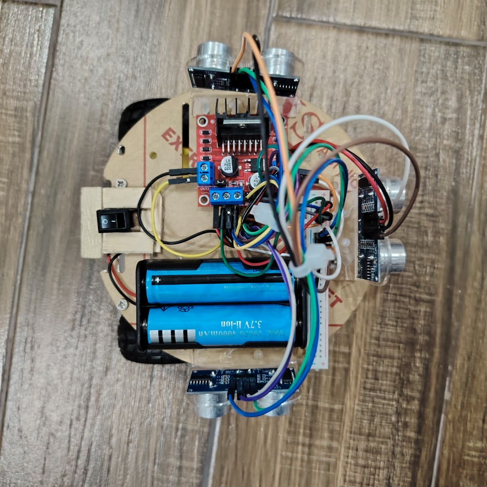
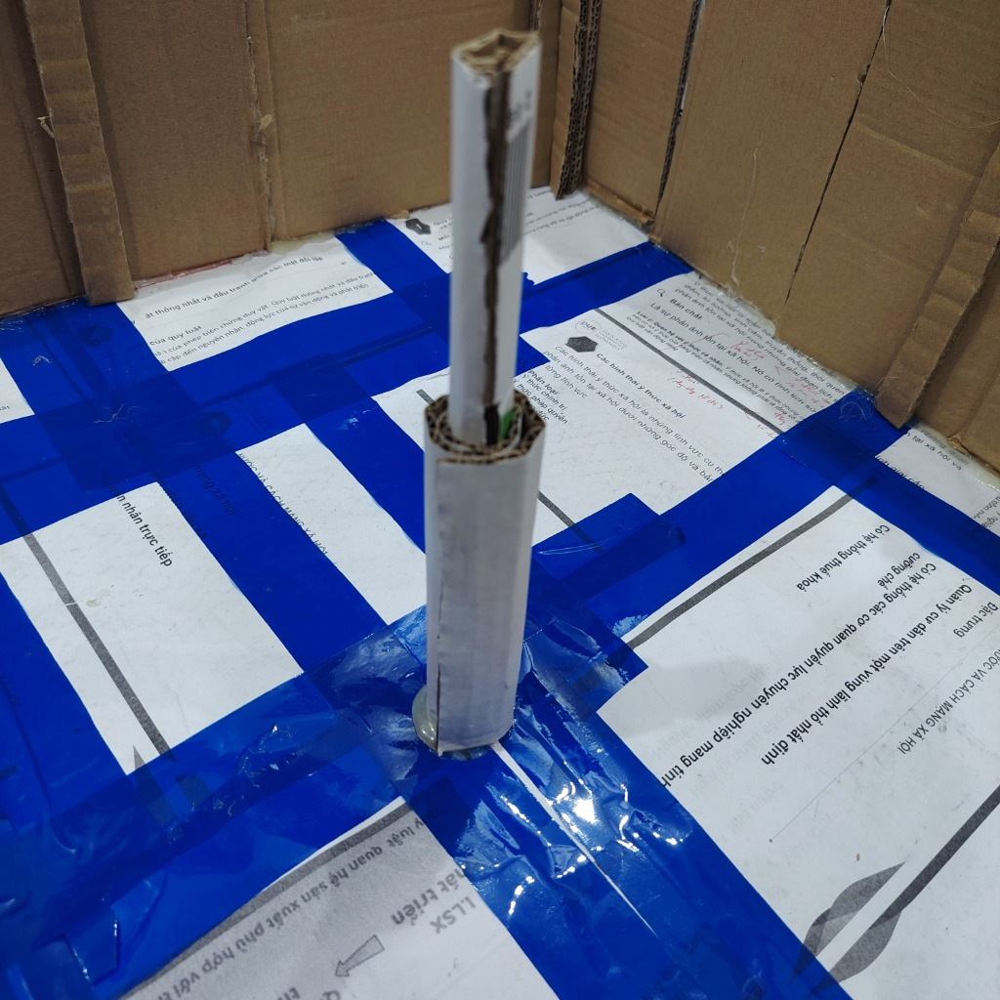
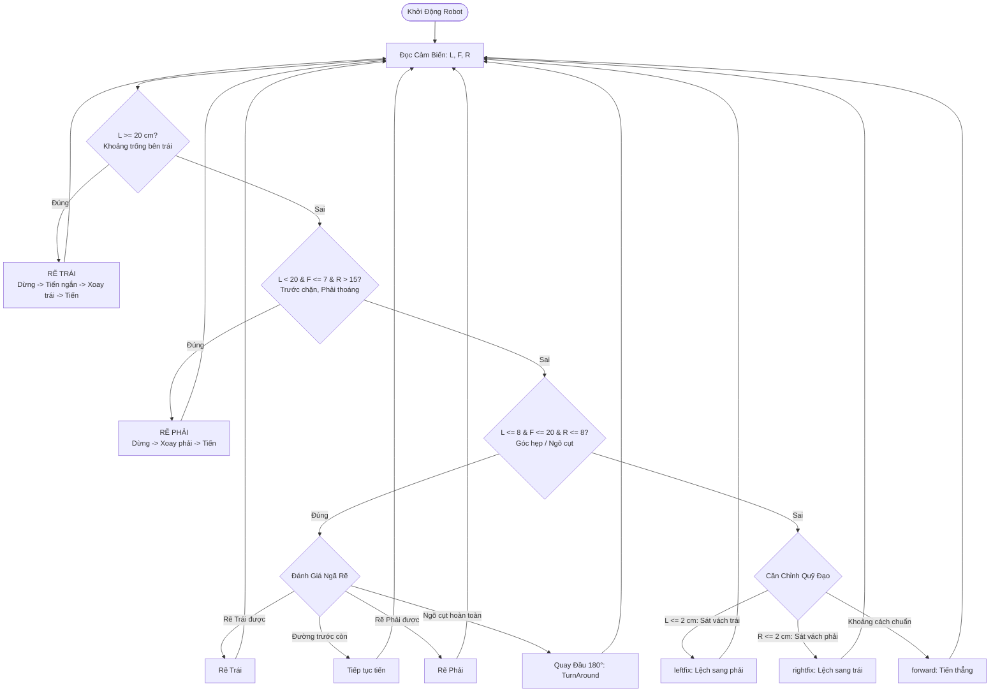

# Robot Maze Runner (Arduino Uno + HC-SR04 + L298N)

[](https://www.arduino.cc/)
[](https://isocpp.org/)
[](#danh-sach-linh-kien)
[](#thuat-toan-dieu-khien)
[](LICENSE)

---

## Giới Thiệu

**Robot Maze Runner** là dự án xe robot tự hành giải mê cung tự động được điều khiển bằng vi điều khiển **Arduino Uno**. Robot sử dụng cụm **3 cảm biến siêu âm HC-SR04** (Trái, Trước, Phải) để nhận diện chướng ngại vật trong thời gian thực, áp dụng thuật toán **Bám tường trái (Left-Hand Wall Follower)** kết hợp cơ chế **tự động căn chỉnh quỹ đạo (Trims/Trajectory Alignment)** và **quay đầu thoát ngõ cụt (Dead-End Escape)**.

---

## Hình Ảnh Thực Tế

| Xe Robot Thực Tế | Sa Bàn Mê Cung Thử Nghiệm |
| :---: | :---: |
|  |  |

---

## Tính Năng Nổi Bật

- **Thuật toán bám tường tối ưu**: Áp dụng quy tắc bàn tay trái (Left-Hand Rule) ưu tiên rẽ trái khi phát hiện khoảng trống, giúp robot tự tìm đường ra khỏi mê cung khép kín.
- **Hệ thống cảm biến 3 hướng**: Đo đạc đồng thời cự ly Vách Trái ($L$), Phía Trước ($F$), và Vách Phải ($R$) với độ trễ thấp.
- **Cơ chế tự cân bằng lệch tâm**: Hai hàm vi chỉnh `leftfix()` và `rightfix()` giúp xe luôn giữ vị trí trung tâm trong lòng mê cung, hạn chế va quẹt thành tường khi di chuyển.
- **Xử lý ngõ cụt**: Tự động nhận diện tình trạng bế tắc (3 mặt đều là vách tường) và thực hiện chuỗi chuyển động lùi - xoay đảo góc 180° an toàn.
- **Điều tốc PWM**: Kiểm soát tốc độ độc lập cho từng kênh động cơ thông qua mạch cầu H L298N.

---

## Danh Sách Linh Kiện

| STT | Linh Kiện | Số Lượng | Mô Tả / Chức Năng |
| :---: | :--- | :---: | :--- |
| 1 | Arduino Uno R3 | 1 | Vi điều khiển trung tâm xử lý dữ liệu và điều hướng |
| 2 | Cảm biến siêu âm HC-SR04 | 3 | Đo khoảng cách (Gắn phía Trước, Trái, Phải) |
| 3 | Mạch cầu H L298N | 1 | Điều khiển 2 động cơ DC (hỗ trợ điều tốc PWM) |
| 4 | Động cơ DC giảm tốc TT | 2 | Động cơ truyền động chính (tỉ số truyền 1:48) |
| 5 | Bánh xe dẫn động | 2 | Bánh xe cao su bám đường |
| 6 | Bánh xe mắt trâu (Caster Wheel) | 1 | Bánh xe xoay tự do hỗ trợ giữ thăng bằng |
| 7 | Khung xe robot 2 tầng | 1 | Khung xe mica / nhôm định hình |
| 8 | Nguồn cấp (Pin 18650 2S/3S) | 1 bộ | Cung cấp nguồn 7.4V - 12V cho động cơ và Arduino |
| 9 | Dây nối cắm Breadboard | ~30 sợi | Dây đực - đực, đực - cái |

---

## Sơ Đồ Đấu Nối Chân

Chi tiết sơ đồ nguyên lý phần cứng xem thêm tại: [docs/wiring_diagram.md](docs/wiring_diagram.md).

### 1. Cụm Cảm Biến Siêu Âm HC-SR04
| Cảm biến | Chân Trigger (Phát) | Chân Echo (Thu) | Nguồn VCC / GND |
| :--- | :---: | :---: | :---: |
| Phía Trước (Front) | `D5` | `D4` | `5V` / `GND` |
| Bên Trái (Left) | `D7` | `D6` | `5V` / `GND` |
| Bên Phải (Right) | `D2` | `D3` | `5V` / `GND` |

### 2. Mạch Công Suất L298N (Motor Driver)
| Ký Hiệu L298N | Chân Arduino Uno | Chức Năng | Tốc Độ / PWM Mặc Định |
| :--- | :---: | :--- | :---: |
| ENA | `D10` | Điều tốc Động cơ Trái (PWM) | $170 \sim 255$ |
| IN1 | `D8` | Hướng tiến/lùi Động cơ Trái | Logic 0/1 |
| IN2 | `D11` | Hướng tiến/lùi Động cơ Trái | Logic 0/1 |
| ENB | `D9` | Điều tốc Động cơ Phải (PWM) | $160 \sim 255$ |
| IN3 | `D12` | Hướng tiến/lùi Động cơ Phải | Logic 0/1 |
| IN4 | `D13` | Hướng tiến/lùi Động cơ Phải | Logic 0/1 |

---

## Thuật Toán Điều Khiển

Hệ thống vận hành theo vòng lặp kiểm tra liên tục khoảng cách 3 hướng với logic ưu tiên bám vách trái:



---

## Hướng Dẫn Cài Đặt và Nạp Code

### 1. Chuẩn Bị Môi Trường
1. Tải và cài đặt [Arduino IDE](https://www.arduino.cc/en/software) (khuyến nghị phiên bản 2.x hoặc 1.8.x).
2. Kết nối Arduino Uno với máy tính bằng cáp USB Type-B.

### 2. Nạp Chương Trình
1. Mở file `mazerunner.ino` bằng Arduino IDE.
2. Tại thanh menu, chọn **Tools** -> **Board** -> **Arduino Uno**.
3. Chọn cổng kết nối tại **Tools** -> **Port** (ví dụ: `COM3`, `COM4` trên Windows hoặc `/dev/ttyUSB0` trên Linux).
4. Nhấn nút **Upload** (phím tắt `Ctrl + U`) để biên dịch và nạp code.
5. Mở **Serial Monitor** (phím tắt `Ctrl + Shift + M`), đặt baud rate `9600` để theo dõi dữ liệu cảm biến thời gian thực.

---

## Hướng Dẫn Tinh Chỉnh

Do cấu tạo cơ khí, ma sát bánh xe và bề mặt sàn có sự chênh lệch, các thông số sau có thể tùy biến trực tiếp trong `mazerunner.ino`:

1. **Cân bằng lực kéo 2 bánh xe**:
   - Nếu robot lệch hướng khi đi thẳng, điều chỉnh giá trị PWM giữa `enA` và `enB` trong hàm `forward()`:
   ```cpp
   analogWrite(enA, 170); // Điều tốc động cơ trái
   analogWrite(enB, 170); // Điều tốc động cơ phải (tăng/giảm để đi thẳng)
   ```
2. **Góc quay 90 độ**:
   - Tinh chỉnh thời gian trễ trong các hàm rẽ để robot xoay góc vuông chuẩn xác:
   ```cpp
   turnleft();
   delay(270); // Tăng hoặc giảm giá trị miligiây để đạt góc 90 độ
   ```
3. **Ngưỡng khoảng cách phát hiện**:
   - `L >= 20`: Ngưỡng nhận diện khoảng trống vách trái để rẽ.
   - `F <= 7`: Cự ly an toàn dừng trước vách cản phía trước.

---

## Cấu Trúc Thư Mục

```plaintext
Robot_Maze_Runner/
├── docs/
│   └── wiring_diagram.md     # Tài liệu và sơ đồ đấu nối chi tiết
├── .github/                  # Mẫu Issue và Pull Request
├── mazerunner.ino            # Mã nguồn chính điều khiển robot
├── .gitignore                # Danh sách loại trừ file tạm build/IDE
├── LICENSE                   # Giấy phép mã nguồn mở MIT
└── README.md                 # Tài liệu hướng dẫn chính của dự án
```
---

## Bản Quyền

Dự án được phân phối theo giấy phép [MIT License](LICENSE).

Tác giả: [Pham Phi Khanh (phihanh-qg)](https://github.com/phihanh-qg)
