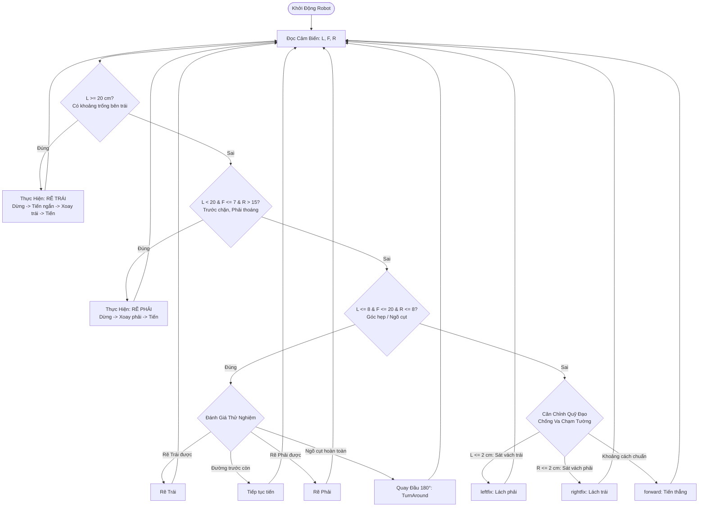

# 🤖 Robot Maze Runner (Arduino Uno + HC-SR04 + L298N)

<p align="center">
  
  
  
  
  
  
</p>

---

## 📌 Giới Thiệu (Overview)

**Robot Maze Runner** là dự án xe robot tự hành giải mê cung tự động được điều khiển bằng vi điều khiển **Arduino Uno**. Robot sử dụng cụm **3 cảm biến siêu âm HC-SR04** (Trái, Trước, Phải) để nhận diện chướng ngại vật trong thời gian thực và áp dụng thuật toán **Bám tường trái (Left-Hand Wall Follower)** kết hợp cơ chế **tự động căn chỉnh quỹ đạo (Trims/Trajectory Alignment)** và **quay đầu thoát ngõ cụt (Dead-End Escape)**.

---

## ✨ Tính Năng Nổi Bật (Key Features)

- 🧭 **Thuật toán bám tường tối ưu**: Triển khai giải thuật *Left-Hand Rule* ưu tiên rẽ trái khi phát hiện khoảng trống, giúp robot tự tìm đường ra khỏi mê cung khép kín.
- ⚡ **Hệ thống cảm biến 3 hướng**: Đo đạc đồng thời cự ly Vách Trái ($L$), Phía Trước ($F$), và Vách Phải ($R$) với độ chính xác cao.
- 🎯 **Cơ chế tự cân bằng lệch tâm**: Hai hàm vi chỉnh `leftfix()` và `rightfix()` giúp xe luôn giữ vị trí trung tâm trong lòng mê cung, chống va quẹt tường khi di chuyển tốc độ cao.
- 🔄 **Xử lý ngõ cụt thông minh**: Tự động nhận diện tình trạng bế tắc (3 mặt là tường) và thực hiện chuỗi chuyển động lùi - xoay đảo góc 180° an toàn.
- 🏎️ **Điều tốc PWM mượt mà**: Điều khiển tốc độ độc lập cho từng động cơ thông qua mạch cầu H L298N.

---

## 🧩 Danh Sách Linh Kiện (Bill of Materials)

| STT | Linh Kiện | Số Lượng | Mô Tả / Chức Năng |
| :---: | :--- | :---: | :--- |
| 1 | **Arduino Uno R3** | 1 | Vi điều khiển trung tâm xử lý dữ liệu và điều hướng |
| 2 | **Cảm biến siêu âm HC-SR04** | 3 | Đo khoảng cách (Gắn phía Trước, Trái, Phải) |
| 3 | **Mạch cầu H L298N** | 1 | Mạch công suất điều khiển 2 động cơ DC (hỗ trợ PWM) |
| 4 | **Động cơ DC giảm tốc TT** | 2 | Động cơ truyền động chính (1:48) |
| 5 | **Bánh xe dẫn động** | 2 | Bánh xe cao su bám đường |
| 6 | **Bánh xe mắt trâu (Caster Wheel)** | 1 | Bánh xe xoay tự do hỗ trợ giữ thăng bằng |
| 7 | **Khung xe robot 2 tầng** | 1 | Khung xe mica / nhựa cứng |
| 8 | **Nguồn cấp (Pin 18650 2S/3S)** | 1 bộ | Cung cấp nguồn 7.4V - 12V cho động cơ và Arduino |
| 9 | **Dây nối cắm Breadboard (Dupont)** | ~30 sợi | Dây đực - đực, đực - cái |

---

## 🔌 Sơ Đồ Đấu Nối Chân (Pinout Mapping)

Chi tiết sơ đồ đấu nối phần cứng xem thêm tại: [docs/wiring_diagram.md](file:///c:/Users/hardf/Desktop/Study/GITHUB/Robot_Maze_Runner/docs/wiring_diagram.md).

### 1. Cụm Cảm Biến Siêu Âm HC-SR04
| Cảm biến | Chân Trigger (Phát) | Chân Echo (Thu) | Nguồn VCC / GND |
| :--- | :---: | :---: | :---: |
| **Phía Trước (Front)** | `D5` | `D4` | `5V` / `GND` |
| **Bên Trái (Left)** | `D7` | `D6` | `5V` / `GND` |
| **Bên Phải (Right)** | `D2` | `D3` | `5V` / `GND` |

### 2. Mạch Công Suất L298N (Motor Driver)
| Ký Hiệu L298N | Chân Arduino Uno | Chức Năng | Tốc Độ / PWM Mặc Định |
| :--- | :---: | :--- | :---: |
| **ENA** | `D10` | Điều tốc Động cơ Trái (PWM) | $170 \sim 255$ |
| **IN1** | `D8` | Hướng tiến/lùi Động cơ Trái | Logic 0/1 |
| **IN2** | `D11` | Hướng tiến/lùi Động cơ Trái | Logic 0/1 |
| **ENB** | `D9` | Điều tốc Động cơ Phải (PWM) | $160 \sim 255$ |
| **IN3** | `D12` | Hướng tiến/lùi Động cơ Phải | Logic 0/1 |
| **IN4** | `D13` | Hướng tiến/lùi Động cơ Phải | Logic 0/1 |

---

## 🧠 Sơ Đồ Thuật Toán Điều Khiển (Algorithm Flowchart)

Hệ thống hoạt động theo vòng lặp kiểm tra liên tục khoảng cách 3 hướng với logic ưu tiên hàng đầu cho việc **Bám vách Trái**:



---

## 🚀 Hướng Dẫn Cài Đặt & Nạp Code (Getting Started)

### Bước 1: Chuẩn Bị Môi Trường
1. Tải và cài đặt [Arduino IDE](https://www.arduino.cc/en/software) (khuyến nghị phiên bản $\ge 2.0$).
2. Kết nối Arduino Uno với máy tính qua cáp USB Type-B.

### Bước 2: Nạp Chương Trình
1. Mở file [mazerunner.ino](file:///c:/Users/hardf/Desktop/Study/GITHUB/Robot_Maze_Runner/mazerunner.ino).
2. Vào **Tools** $\rightarrow$ **Board** $\rightarrow$ Chọn **Arduino Uno**.
3. Vào **Tools** $\rightarrow$ **Port** $\rightarrow$ Chọn cổng COM nhận dạng Arduino.
4. Nhấn nút **Upload** (Mũi tên tròn $\rightarrow$) để biên dịch và nạp code vào vi điều khiển.
5. Mở **Serial Monitor** (phím tắt `Ctrl + Shift + M`), đặt tốc độ Baud là `9600` để theo dõi nhật ký hoạt động.

---

## 🛠️ Hướng Dẫn Tinh Chỉnh (Tuning & Calibration)

Do cấu tạo cơ khí, độ ma sát của bánh xe và sàn chạy khác nhau ở mỗi môi trường, bạn có thể tinh chỉnh các tham số trong file `mazerunner.ino`:

1. **Cân bằng lực kéo 2 bánh xe**:
   - Nếu robot bị lệch sang một bên khi đi thẳng, điều chỉnh tỷ lệ PWM giữa `enA` và `enB` trong hàm `forward()`:
   ```cpp
   analogWrite(enA, 170); // Điều tốc động cơ trái
   analogWrite(enB, 170); // Điều tốc động cơ phải (tăng/giảm để đi thẳng hoàn hảo)
   ```
2. **Góc quay 90 độ**:
   - Tinh chỉnh thời gian `delay(...)` trong các hàm `turnleft()` và `turnright()` để đảm bảo robot xoay đúng góc vuông $90^\circ$:
   ```cpp
   turnleft();
   delay(270); // Điều chỉnh giá trị này nếu xoay chưa đủ hoặc quá 90 độ
   ```
3. **Ngưỡng khoảng cách phát hiện**:
   - `L >= 20`: Phát hiện ngã rẽ bên trái (khoảng hở).
   - `F <= 7`: Khoảng cách an toàn dừng trước vách tường phía trước.

---

## 📂 Cấu Trúc Thư Mục (Repository Structure)

```plaintext
Robot_Maze_Runner/
├── docs/
│   └── wiring_diagram.md     # Tài liệu và sơ đồ đấu dây chi tiết
├── .github/                  # Cấu hình GitHub templates & workflows
├── mazerunner.ino            # Mã nguồn chính điều khiển robot
├── .gitignore                # Danh sách loại trừ file tạm build/IDE
├── LICENSE                   # Giấy phép phần mềm mã nguồn mở MIT
└── README.md                 # Tài liệu hướng dẫn chính của dự án
```

---

## 🤝 Đóng Góp (Contributing)

Mọi đóng góp nhằm tối ưu mã nguồn, cải thiện giải thuật (thuật toán Floodfill, Tremaux, PID Controller) đều được hoan nghênh:
1. Fork dự án
2. Tạo nhánh tính năng (`git checkout -b feature/Optimization`)
3. Commit thay đổi (`git commit -m 'Add PID wall following'`)
4. Push lên nhánh (`git push origin feature/Optimization`)
5. Mở một **Pull Request**

---

## 📄 Bản Quyền (License)

Dự án được phân phối dưới giấy phép **MIT License**. Xem chi tiết tại [LICENSE](file:///c:/Users/hardf/Desktop/Study/GITHUB/Robot_Maze_Runner/LICENSE).

---

<p align="center">
  Phát triển bởi <b><a href="https://github.com/phihanh-qg">Pham Phi Khanh (phihanh-qg)</a></b>
</p>
