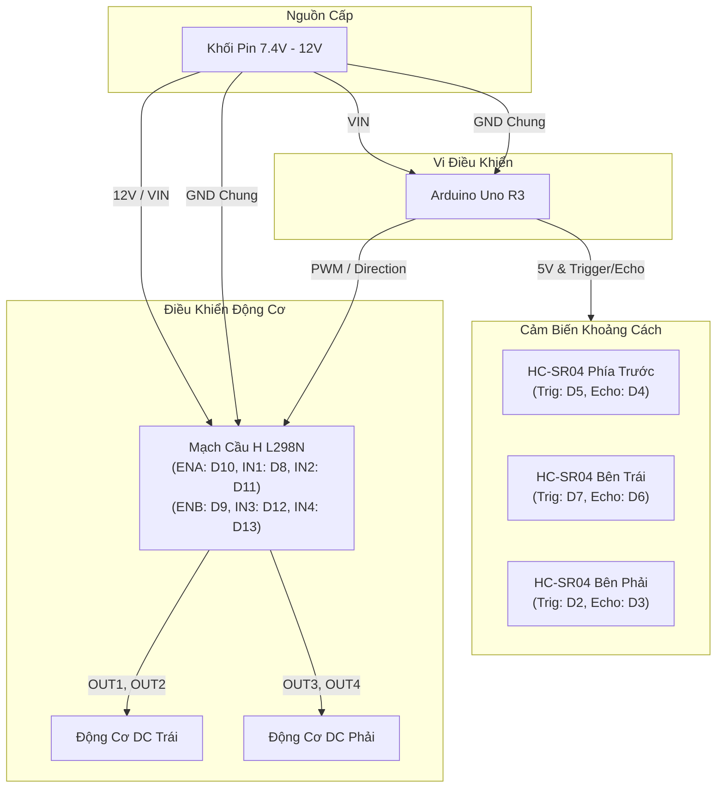

# Sơ Đồ Đấu Dây Chi Tiết

Tài liệu hướng dẫn kết nối phần cứng giữa Arduino Uno R3, mạch cầu H L298N, và 3 cảm biến siêu âm HC-SR04 cho robot giải mê cung.

---

## 1. Bảng Phân Bổ Chân (Pinout Mapping)

### Cảm Biến Siêu Âm (HC-SR04)

Hệ thống sử dụng 3 cảm biến siêu âm đo khoảng cách 3 hướng: Trái (Left), Trước (Front), và Phải (Right).

| Vị Trí Cảm Biến | Chân HC-SR04 | Chân Arduino Uno | Chức Năng |
| :--- | :--- | :--- | :--- |
| **Front (Phía trước)** | VCC | 5V | Nguồn cấp cảm biến |
| | GND | GND | Nối mass chung |
| | **Trig (F)** | **D5** | Kích xung siêu âm (Output) |
| | **Echo (F)** | **D4** | Nhận xung phản hồi (Input) |
| **Left (Bên trái)** | VCC | 5V | Nguồn cấp cảm biến |
| | GND | GND | Nối mass chung |
| | **Trig (L)** | **D7** | Kích xung siêu âm (Output) |
| | **Echo (L)** | **D6** | Nhận xung phản hồi (Input) |
| **Right (Bên phải)** | VCC | 5V | Nguồn cấp cảm biến |
| | GND | GND | Nối mass chung |
| | **Trig (R)** | **D2** | Kích xung siêu âm (Output) |
| | **Echo (R)** | **D3** | Nhận xung phản hồi (Input) |

---

### Mạch Điều Khiển Động Cơ (L298N)

| Chân L298N | Chân Arduino Uno | Chức Năng | Ghi Chú |
| :--- | :--- | :--- | :--- |
| **ENA** | **D10** (PWM) | Điều khiển tốc độ Động cơ A (Trái) | Tháo jumper ENA để dùng PWM |
| **IN1** | **D8** | Hướng quay 1 Động cơ A | Digital Output |
| **IN2** | **D11** (PWM) | Hướng quay 2 Động cơ A | Digital Output |
| **ENB** | **D9** (PWM) | Điều khiển tốc độ Động cơ B (Phải) | Tháo jumper ENB để dùng PWM |
| **IN3** | **D12** | Hướng quay 1 Động cơ B | Digital Output |
| **IN4** | **D13** | Hướng quay 2 Động cơ B | Digital Output |
| **OUT1, OUT2** | Động cơ Trái (Motor A) | Xuất nguồn cho động cơ DC trái | |
| **OUT3, OUT4** | Động cơ Phải (Motor B) | Xuất nguồn cho động cơ DC phải | |

---

### Sơ Đồ Nguồn Cấp

Lưu ý quan trọng về cấp nguồn:
- **GND Chung (Common Ground)**: Bắt buộc phải nối chân GND của mạch L298N với chân GND của Arduino Uno. Nếu không nối chung mass, tín hiệu logic điều khiển giữa hai mạch sẽ bị sai lệch.
- **Nguồn động cơ**: Không cấp nguồn cho động cơ trực tiếp từ chân 5V của Arduino. Cần sử dụng bộ pin rời (7.4V - 12V) đưa vào cọc nguồn 12V của L298N.

| Thiết Bị | Chân Kết Nối | Nguồn Cấp Đề Xuất |
| :--- | :--- | :--- |
| **Bộ pin (2S/3S Li-ion 7.4V - 12V)** | (+) Cực dương | Cọc 12V trên L298N và chân VIN của Arduino |
| | (-) Cực âm | Cọc GND trên L298N và chân GND Arduino |
| **Arduino Uno 5V Out** | 5V | Cấp cho chân VCC của 3 cảm biến HC-SR04 |

---

## 2. Sơ Đồ Khối Kết Nối Hệ Thống

---

## 3. Lưu Ý Kỹ Thuật Khi Lắp Ráp

1. **Chiều quay động cơ**:
   - Nếu khi gọi hàm `forward()` mà bánh xe quay ngược chiều, đảo 2 dây tại cọc `OUT1/OUT2` hoặc `OUT3/OUT4`.
2. **Chống nhiễu cảm biến siêu âm**:
   - Bố trí 3 cảm biến lệch góc hoặc cách nhau hợp lý trên khung để chùm sóng siêu âm không dội chéo gây sai số đo.
